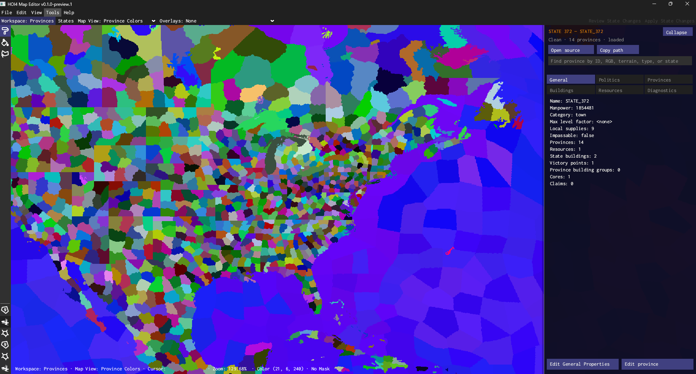
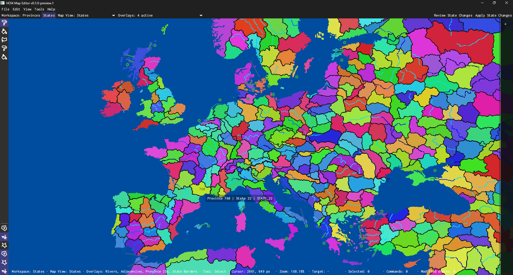

# HOI4 Map Editor

A visual province and state editor for Hearts of Iron IV mods.

Paint provinces, edit terrain, organize states, and review changes without manually editing large bitmaps, CSV rows, or PDXScript files.

HOI4 Map Editor is based on [ScottyThePilot's HOI4 Province Editor](https://github.com/ScottyThePilot/hoi4_province_editor) and extends it with state editing, map views, project validation, backups, rollback, recovery, and safer file updates.

[Download the latest preview](https://github.com/AdriianCOE/hoi4_state_editor/releases)

> **Preview software:** keep an independent backup of every mod you edit.




## Features

### Province editing

- Paint, fill, recolor, and lasso-select provinces directly on the map.
- Edit terrain, province type, coastal status, continent, RGB color, and definition data.
- Inspect province IDs, colors, terrain, state assignments, and map diagnostics.
- Search and focus provinces by technical properties.
- Undo and redo geographic changes.
- Save `provinces.bmp` and `definition.csv` through validated per-file atomic replacements.

### State editing

- Select provinces with Select, Brush, Lasso, or Fill.
- Assign, move, or unassign provinces between states.
- Create and remove states.
- Edit:
  - name and category;
  - manpower and local supplies;
  - owner and controller;
  - cores and claims;
  - resources;
  - state buildings;
  - victory points;
  - province buildings.
- Keep changes in memory until they are reviewed and applied.
- Undo, redo, or discard state changes.

### Map views

Switch between:

- Province Colors
- Province Types
- Terrain
- Continents
- Coastal Provinces
- States
- Political

Optional overlays include:

- Rivers
- Adjacencies
- Province IDs
- Province Borders
- State Borders
- Custom Image Overlay

### Search and navigation

Use `Ctrl+F` to find provinces and states by:

- ID;
- state name;
- province color;
- terrain;
- type;
- owner or controller;
- continent;
- coastal status;
- current state assignment.

Selecting a result focuses and zooms the map automatically.

### Safe file updates

**Save Project** reviews every pending Province Map and State change together.

- prepares `provinces.bmp`, `definition.csv`, and all affected
  `history/states/*.txt` candidates before the first mod write;
- validates the combined candidate in a physical temporary copy;
- creates one verified backup and durable journal;
- replaces each affected file atomically in deterministic order;
- rolls back the coordinated operation when a later step fails;
- reloads and verifies the complete project before clearing dirty state;
- detects external file changes and supports interrupted-save recovery.

This is a transactional, rollback-capable project save. Windows does not offer
one filesystem operation that atomically replaces the whole multi-file project.

Existing state files retain unrelated comments, formatting, unknown fields, and unsupported blocks.

### Settings and languages

The interface is available in:

- English
- Português do Brasil
- Español
- Français
- Русский
- 简体中文

Application settings are stored under the user's Windows profile.

Optional project settings are stored in:

```text
<mod>/.hoi4-map-editor/project.toml
```

State backups and recovery data are stored in:

```text
<mod>/.hoi4-state-editor/
```

## Installation

1. Download the Windows x64 ZIP from [GitHub Releases](https://github.com/AdriianCOE/hoi4_state_editor/releases).
2. Extract the ZIP into a writable folder.
3. Run `HOI4 Map Editor.exe`.
4. Select **File → Open HOI4 Mod...**
5. Choose the root folder of your mod.

Do not run the application directly from inside the ZIP.

A compatible project normally contains:

```text
mod-root/
├─ map/
│  ├─ provinces.bmp
│  ├─ definition.csv
│  ├─ heightmap.bmp
│  ├─ adjacencies.csv
│  └─ rivers.bmp
└─ history/
   └─ states/
      └─ *.txt
```

Only `provinces.bmp` and `definition.csv` are required for province editing.

The States workspace additionally uses `history/states/*.txt`.

## Basic workflow

```text
Open Mod
→ Edit Provinces and/or States
→ Review Project Changes
→ Validate Combined Temporary Copy
→ Save Project
→ Reload and Verify
```

**Export Province Map As...** remains separate and never clears project dirty
state.

## Essential shortcuts

| Shortcut | Action |
| --- | --- |
| `Ctrl+O` | Open a mod |
| `Ctrl+S` | Review and Save Project |
| `Ctrl+Shift+S` | Export Province Map As |
| `Ctrl+1` | Provinces workspace |
| `Ctrl+2` | States workspace |
| `Ctrl+Tab` | Switch workspace |
| `Ctrl+F` | Search |
| `1`–`7` | Change Map View |
| `B` | Brush |
| `F` | Fill |
| `L` | Lasso |
| `Ctrl+Z` / `Ctrl+Y` | Undo / Redo |
| `Esc` | Cancel the current action |
| `H` | Reset zoom |

Map shortcuts are suspended while typing in a field, picker, or search box.

## Current limitations

- Preview builds currently support Windows x64 only.
- The Validation Results window currently offers basic all-domain results;
  advanced report export and persistent ignore policies are planned.
- Country names, state localizations, and other game-data localizations are not loaded from the game yet.
- Country flags and game icons are not displayed yet.
- Adjacencies can be inspected, but the full editing workspace is still planned.
- Strategic Regions and Continents do not yet have complete dedicated editing workspaces.
- Rivers, supply networks, heightmaps, and tree maps are not directly editable.
- The executable is not currently digitally signed, so Windows SmartScreen may display a warning for early preview builds.

The project does not distribute proprietary Hearts of Iron IV assets.

## Planned development

### Game data integration

- Load localized country, state, building, resource, terrain, and category names.
- Resolve data from both the mod and the local Hearts of Iron IV installation.
- Use mod files as overrides over vanilla data.
- Display real country colors in the Political Map View.
- Search using localized names and technical identifiers.

### Flags and interface assets

- Read country flags from the local game or mod.
- Resolve `.gfx` definitions and `.dds` textures.
- Display game icons without distributing Paradox assets.
- Add a local asset cache for faster project loading.

### Adjacencies

- Create, edit, and remove adjacency entries.
- Support sea crossings, canals, and through-province connections.
- Validate endpoints and malformed adjacency records.
- Preview changes directly on the map.

### Project validation

- Validate province colors and IDs.
- Detect missing or duplicate state assignments.
- Check coastal provinces and naval bases.
- Validate state, strategic region, and continent references.
- Produce a report with direct navigation to each problem.

### Strategic Regions

- Display region boundaries and membership.
- Create and edit strategic regions.
- Assign and remove states.
- Edit weather and related region data.
- Validate and save region files safely.

### Continents

- Inspect continent assignments.
- Assign provinces to continents.
- Create and rename continent definitions.
- Validate continent IDs and province references.

### Later tools

Possible additions after the core editor is stable:

- Rivers editing
- Supply network editing
- Heightmap tools
- Tree map editing
- Project autosave and workspace recovery
- External file change detection
- Procedural island and province generation
- Steam Workshop publishing helpers

Planned features are not guaranteed and may change based on testing and community feedback.

## Documentation

- [User Guide](docs/USER_GUIDE.md)
- [Troubleshooting](docs/TROUBLESHOOTING.md)
- [Privacy](docs/PRIVACY.md)
- [Changelog](CHANGELOG.md)

## Building from source

Install a current Rust toolchain and run:

```sh
cargo build --release
```

To create the portable Windows package:

```powershell
.\scripts\package-windows.ps1
```

The packaging script creates the ZIP, SHA-256 checksum, and release manifest in `dist/`.

## Reporting issues

When reporting a problem, include:

- application version;
- Windows version;
- workspace and tool being used;
- steps to reproduce the problem;
- relevant local log output;
- screenshots when the problem is visual.

Logs are stored under:

```text
%LOCALAPPDATA%\HOI4MapEditor\logs
```

Do not upload an entire mod unless it is necessary and you have permission to share it.

## Support

<a href="https://ko-fi.com/adriiancoe">
  
</a>

Support helps with development, testing, documentation, and future updates.

## Credits

Based on [HOI4 Province Editor](https://github.com/ScottyThePilot/hoi4_province_editor) by ScottyThePilot.

Developed and extended by Adrian Costa.

HOI4 Map Editor is an unofficial community project and is not affiliated with or endorsed by Paradox Interactive.

The project retains the original MIT license and all applicable third-party notices.
